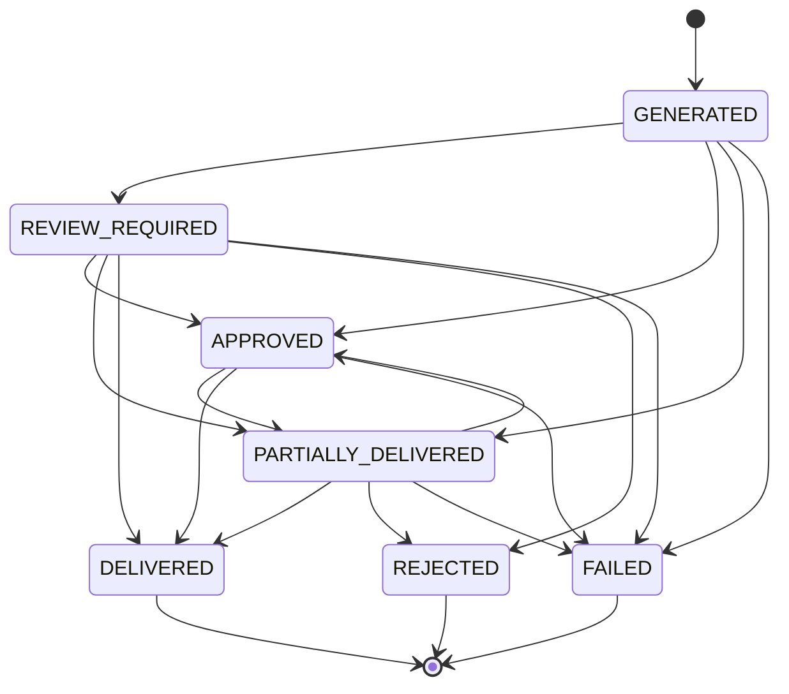

# Content Factory Delivery & Distribution MVP

## Overview

The **Content Factory Delivery & Distribution MVP** establishes an orchestrated, typed delivery system that converts verified Reel analyses into structured `ContentPackage` artifacts. It enforces explicit lifecycle states, manual approval gates for external platforms, idempotent delivery records, bot-level review controls, and strict preservation of core delivery semantics (Telegram user delivery and channel deduplication).

---

## Core Principle: Generation != Approval != Publication

The pipeline strictly isolates the three stages of content lifecycle:
1. **Generation**: The worker deterministically produces output variants (`TLDR`, `TELEGRAM_LONG`, `X_POST`, `THREADS_POST`, `YOUTUBE_COMMUNITY`) from the verified `CanonicalContentResult`. A `ContentPackage` is assembled with status `REVIEW_REQUIRED` (or `PARTIALLY_DELIVERED` once internal Telegram delivery succeeds).
2. **Approval**: Manual review by the reel owner. External platforms (`X`, `THREADS`, `YOUTUBE_COMMUNITY`) remain in `PENDING_APPROVAL` until the owner explicitly approves.
3. **Publication**: Level A publication boundary. Upon approval, external targets transition to `APPROVED_NOT_CONNECTED`, signaling readiness for distribution without attempting fake or unauthenticated HTTP requests to external APIs.

---

## Data Contracts (`app/worker/content_package.py`)

### Enumerations
- **`PackageStatus`**: `GENERATED`, `REVIEW_REQUIRED`, `APPROVED`, `PARTIALLY_DELIVERED`, `DELIVERED`, `REJECTED`, `FAILED`
- **`TargetPlatform`**: `TELEGRAM_USER`, `TELEGRAM_CHANNEL`, `X`, `THREADS`, `YOUTUBE_COMMUNITY`
- **`PublicationMode`**: `AUTOMATIC`, `MANUAL_APPROVAL`, `DISABLED`
- **`TargetDeliveryStatus`**: `NOT_RENDERABLE`, `PENDING_APPROVAL`, `APPROVED_NOT_CONNECTED`, `IN_FLIGHT`, `DELIVERED`, `SKIPPED_DUPLICATE`, `FAILED`, `REJECTED`
- **`DeliveryOutcome`**: `SUCCEEDED`, `SKIPPED_DUPLICATE`, `FAILED`, `APPROVED_NOT_CONNECTED`, `REJECTED`

### Models
- **`DistributionTarget`**: Defines target platform, associated variant type, publication mode, approval requirement, status, and rendered text.
- **`DeliveryRecord`**: Immutable log of an attempt to deliver a variant to a target, containing `delivery_id`, `package_id`, `target`, `variant`, `attempt_id`, `approval_state`, `status`, `external_id`, `idempotency_key`, `error_code`, `error_message`, `started_at`, and `finished_at`.
- **`ContentPackage`**: Comprehensive container binding `package_id`, `job_id`, `source_url`, `contract_version`, `canonical_content`, `output_variants`, `distribution_targets`, `approval_state`, and `delivery_records`.

---

## Lifecycle State Machine (`VALID_TRANSITIONS`)

Invalid transitions raise `ValueError` and prevent inconsistent state mutations.

---

## Bot Review Controls (`app/bot/package_handlers.py`)

Interactive Telegram inline keyboard controls enable the job owner to inspect and govern the content package:
- **`pkg:menu:<job_id>`**: Opens the distribution package menu showing per-target statuses (`TELEGRAM_USER`, `TELEGRAM_CHANNEL`, `X`, `THREADS`, `YOUTUBE_COMMUNITY`) and actions.
- **`pkg:view:<job_id>:<variant_name>`**: Renders the exact text for an output variant with buttons to regenerate or return.
- **`pkg:approve_all:<job_id>`**: Approves all pending external targets, moving them to `APPROVED_NOT_CONNECTED` and creating immutable delivery records.
- **`pkg:reject:<job_id>`**: Rejects external publication, locking targets in `REJECTED`.
- **`pkg:regen:<job_id>:<variant_name>`**: Deterministically re-renders the variant directly from `CanonicalContentResult` with zero factual mutation.
- **`pkg:back:<job_id>`**: Returns to the main analysis keyboard.

### Security and Ownership
Every `pkg:*` callback verifies `callback.from_user.id == job.user_id`. Unauthorized users receive an alert and are strictly denied permission to approve, reject, or modify packages.

---

## Database Architecture (`app/db/models.py` & `app/db/migrate.py`)

### `content_packages` Table
- `id` (VARCHAR, PK)
- `job_id` (VARCHAR, FK -> jobs.id, indexed)
- `source_url` (VARCHAR, NOT NULL)
- `contract_version` (VARCHAR, NOT NULL, `content_package_v1`)
- `status` (VARCHAR, NOT NULL)
- `language_context` (JSON)
- `router_result` (JSON)
- `priority_result` (JSON)
- `canonical_content` (JSON, NOT NULL)
- `output_variants` (JSON, NOT NULL)
- `distribution_targets` (JSON, NOT NULL)
- `created_at` / `updated_at` (TIMESTAMP WITHOUT TIME ZONE, naive UTC)

### `content_deliveries` Table
- `id` (VARCHAR, PK)
- `package_id` (VARCHAR, FK -> content_packages.id, indexed)
- `target` (VARCHAR, NOT NULL)
- `variant` (VARCHAR, NOT NULL)
- `attempt_id` (INTEGER, NOT NULL)
- `status` (VARCHAR, NOT NULL)
- `external_id` (VARCHAR)
- `idempotency_key` (VARCHAR, UNIQUE, NOT NULL)
- `error_code` (VARCHAR)
- `error_message` (TEXT)
- `started_at` / `finished_at` (TIMESTAMP WITHOUT TIME ZONE, naive UTC)

---

## Deterministic Replay Evaluation (`tests/fixtures/distribution_eval.json`)

The replay evaluation suite covers 10 comprehensive distribution scenarios:
1. Standard package creation and automatic Telegram delivery.
2. Manual approval of external targets by owner (`APPROVED_NOT_CONNECTED`).
3. Unauthorized approval attempt (strict security rejection).
4. Rejection of package by owner.
5. Invariant preservation during variant regeneration (zero factual mutation).
6. Idempotent re-execution of delivery without duplicate dispatches.
7. Risk warning preservation across external platforms.
8. Unrenderable variant budget compliance.
9. Duplicate channel dispatch skipping.
10. End-to-end multi-target delivery flow.

### Verification Results
- Scenarios: **10/10 passed (1.0000)**
- Lifecycle correctness: **1.0000**
- Approval enforcement: **1.0000**
- Target status accuracy: **1.0000**
- Unauthorized approval violations: **0**
- Duplicate publication violations: **0**
- Factual mutation violations: **0**
- Risk warning violations: **0**
- Idempotency violations: **0**
- All gates passed: **True**
